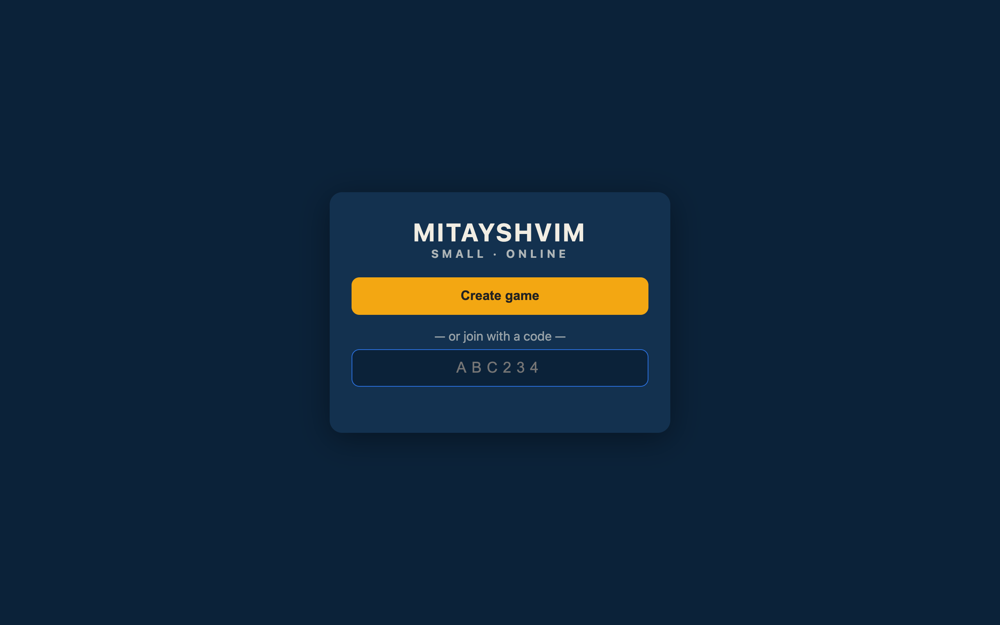
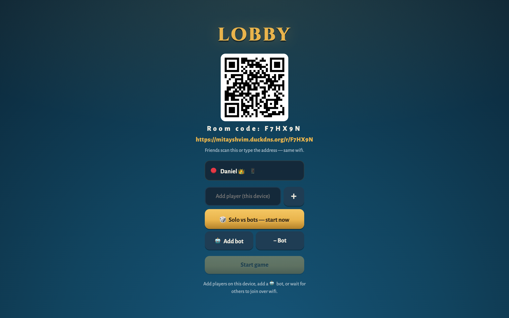
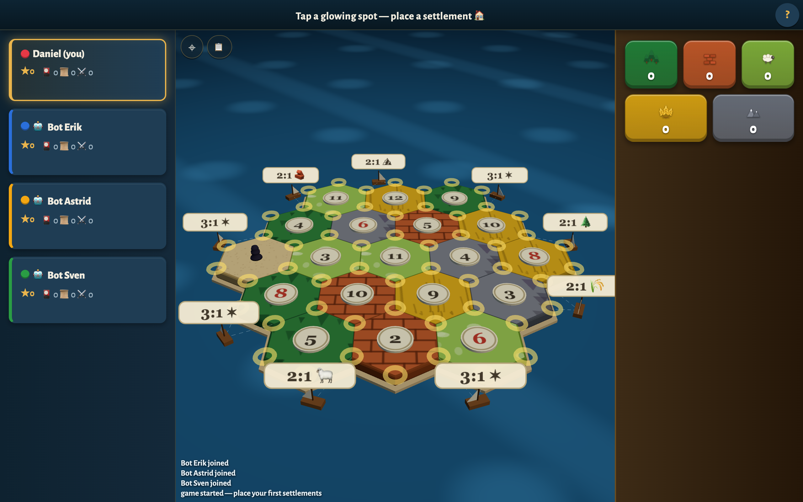
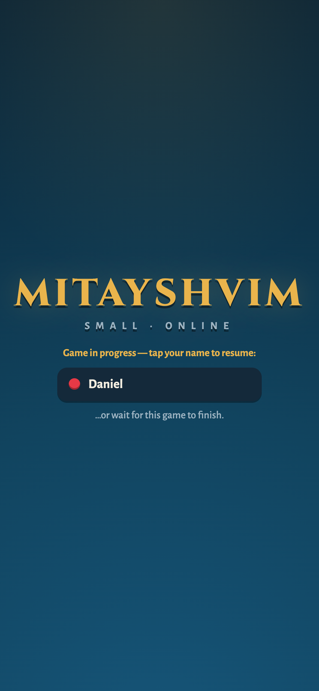

# Small Mitayshvim

A hex-based settlement and trading board game for 2–4 players (plus bots).
Create a game, share the 6-character room code, and play from any device —
phone or desktop, anywhere.

### ▶ Play now: **[mitayshvim.duckdns.org](https://mitayshvim.duckdns.org)** (alias: [mityashvim.duckdns.org](https://mityashvim.duckdns.org))

[](https://github.com/NisoD/Ktannul/actions/workflows/ci.yml)
[](https://github.com/NisoD/Ktannul/actions/workflows/uptime.yml)

---

| Landing | Lobby (QR + room code) | 3D board |
|---|---|---|
|  |  |  |

<p align="center">
  
</p>

## How to play

1. Open the site, tap **Create game** → you get a room code (e.g. `F7HX9N`).
2. Friends scan the QR or enter the code at the landing page — from any network.
3. Add bots to fill empty seats, or play solo against them.
4. Standard rules: build settlements/cities/roads, trade, dev cards,
   longest road, largest army, first to 10 points wins.

## Architecture

Single Go binary, standard library only — no frameworks, no external services.

```
Browser ──HTTPS──▶ Caddy (TLS) ──localhost:8080──▶ mitayshvim
                                                      │
   SSE state push ◀──────────────────────────────────┤  in-memory rooms
   POST actions   ─────────────────────────────────▶ │  + per-room gob snapshots
```

- **`game/`** — pure rules engine; every action validated server-side, per-player
  views keep hands private. Untouched by the networking layer.
- **`hub.go`** — game rooms keyed by code: create, join, fan-out on change,
  snapshot to `data/<code>.gob`, expire idle rooms (1h lobby / 24h game).
- **`httpserver.go`** — room-scoped HTTP API, per-IP rate limits, body-size
  caps, CSP and security headers, proxy-aware client IP.
- **`code.go`** — crypto/rand room codes (unambiguous 32-char alphabet).
- **`main.go`** — wiring, bot ticker, janitor, graceful shutdown (snapshots
  all rooms on SIGTERM so deploys never drop a game in progress).
- **`web/`** — `landing.html` (create/join) and `index.html` (the full game
  UI with a Three.js 3D board); vanilla JS, no build step.

## Security

Threat model and controls live in
[`docs/superpowers/specs/`](docs/superpowers/specs/). Highlights:

- Room codes are crypto-random (~1B space); unguessable, no public room list.
- 128-bit crypto/rand session tokens; every action bound to its seat.
- Per-IP rate limits on room creation and API; 4 KB request body cap.
- CSP + `nosniff` + `DENY` framing; player names rendered as inert text
  (XSS-tested in the e2e suite).
- TLS 1.2+ only, automatic certificates via Caddy.
- Runs as an unprivileged, sandboxed systemd service (no capabilities,
  syscall-filtered, read-only filesystem except its data dir).

## Run locally

```sh
go run . -addr :8080 -data ./data
```

Open <http://localhost:8080>, create a game, share the link.

## Test

```sh
go test ./... -race          # engine + hub + handler unit tests
node e2e/rooms.test.mjs       # Playwright: room isolation, reconnect, XSS, redirects
```

## Deploy

Runs on an **Oracle Cloud Always Free** ARM VM behind Caddy — see
[`deploy/README.md`](deploy/README.md) for the full runbook (VM, firewall,
TLS, systemd). Hosting cost: **$0**.

## License

Personal hobby project. Game mechanics are not copyrightable; this project
uses no trademarked names or artwork from any commercial board game.
